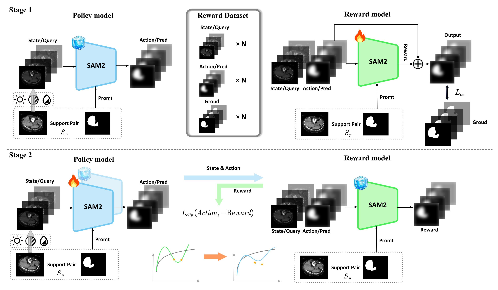

# RE-SAM2: Boosting Few-Shot Medical Image Segmentation via Reinforcement Learning and Ensemble Learning



### Dependencies

Flowing [SAM2](https://github.com/facebookresearch/sam2), download checkpoint [sam2_hiera_tiny](https://dl.fbaipublicfiles.com/segment_anything_2/072824/sam2_hiera_tiny.pt) and run SAM2 model. Make sure your environment supports running SAM2.

Additional Dependencies Required:

```
dcm2nii
logging
datetime
json5==0.8.5
jupyter==1.0.0
nibabel==2.5.1
numpy==1.22.0
opencv-python==4.5.5.62
Pillow>=8.1.1
sacred==0.8.2
scikit-image==0.18.3
SimpleITK==1.2.3
tqdm==4.62.3
#torch==2.2.1
#torchvision=0.17.1
```

## Run Demo:

download checkpoint [sam2_hiera_tiny](https://dl.fbaipublicfiles.com/segment_anything_2/072824/sam2_hiera_tiny.pt) and place it in the **checkpoints** folder.

```
Project/
├── RE_SAM2/
│   ├── checkpoints/
│   │   ├── sam2_hiera_tiny.pt
│   ├── demo.py
├── README.md
```

```
cd RE_SAM2
python demo.py
```

## Run Code:

The pre-processed data can be downloaded by:

1. [Pre-processed CHAOS-T2 data](https://drive.google.com/drive/folders/12-oaFZP6LjrKUFcydJplx9QUOfO8qn3o)
2. [Pre-processed SABS data](https://drive.google.com/drive/folders/1fLPY2MLIsQwREgsTz2IZTBASFch_IcqS?usp=drive_link)
3. [Pre-processed CMR data](https://drive.google.com/drive/folders/100-QvlvtCeiHTioGjb--U_oU6gvg5oUc?usp=sharing)

```
Project/
├── Dataset/
│   ├── CHAOST2/
│   ├── SABS/
│   ├── CMR/
├── RE_SAM2/
│   ├── checkpoints/
│   │   ├── sam2_hiera_tiny.pt
│   ├── train_and_test.py
├── README.md
```

Run All Datasets

```
python train_and_test.py
```

Run CHAOS-T2:

```
python train_and_test.py --dataset CHAOST2
```

Run SABS:

```
python train_and_test.py --dataset SABS
```

Run CMR:

```
python train_and_test.py --dataset CMR
```

## Todo

Make the code and its initial execution simpler.

## Acknowledgement

Our code is based the works: [SSL-ALPNet](https://github.com/cheng-01037/Self-supervised-Fewshot-Medical-Image-Segmentation), [ADNet](https://github.com/sha168/ADNet) ,[QNet](https://github.com/ZJLAB-AMMI/Q-Net), [RPT](https://github.com/YazhouZhu19/RPT) and [SAM2](https://github.com/facebookresearch/sam2). Appreciate their excellent work.


